# 📱 Bakan — Gestion Complète des Ventes et Activités


> **Bakan** est une application mobile Flutter tout-en-un, conçue pour les commerçants, petites entreprises et gestionnaires souhaitant suivre leurs **stocks**, **ventes**, **clients**, **portefeuilles** et **tâches** en toute simplicité, avec une expérience fluide et une interface moderne 🇨🇮.

---

## ✨ Fonctionnalités Clés

### 🧾 Tableau de Bord
- Vue d’ensemble rapide : total des ventes, top clients, évolution mensuelle.
- Graphiques animés : barres, camemberts, statistiques visuelles professionnelles.

### 📦 Gestion des Produits
- Création, modification, suppression de produits.
- Suivi automatique du stock après chaque vente.

### 💰 Suivi des Ventes
- Enregistrement de chaque vente avec génération de ticket.
- Accès à l’historique des ventes.

### 👥 Clients
- Ajout de clients avec historique d’achat.
- Affichage du top 5 des clients les plus actifs.

### 👛 Portefeuille
- Ajout de dépenses par catégories personnalisées.
- Statistiques de dépenses filtrées par jour, mois ou année.
- Interface de type carte bancaire.

### ✅ Tâches & Notifications
- Ajout de tâches avec échéance.
- Alertes automatiques avec rappel à l’approche des dates limites.

### 🔐 Authentification & Sécurité
- Interface de connexion moderne.
- Réinitialisation de mot de passe par OTP (code 4 chiffres) et validation.

---

## 📂 Structure du Projet

```
lib/
├── config/           → Thèmes & constantes
├── database/         → Accès à SQLite via DBHelper
├── views/            → Toutes les pages de l'app
│   ├── auth/         → Connexion, inscription, mot de passe oublié
│   ├── dashboard/    → Page d'accueil avec statistiques
│   ├── products/     → Gestion des produits
│   ├── sales/        → Gestion des ventes
│   ├── tasks/        → Gestion des tâches
│   ├── wallet/       → Portefeuille & finances
├── widgets/          → Composants réutilisables
├── main.dart         → Initialisation de l'app, préférences, routes
```

---

## 🧪 Screenshots

---

| Écran 1 | Écran 2 | Écran 3 | Écran 4 | Écran 5 | Écran 6 |
|--------|---------|---------|--------|---------|---------|
| 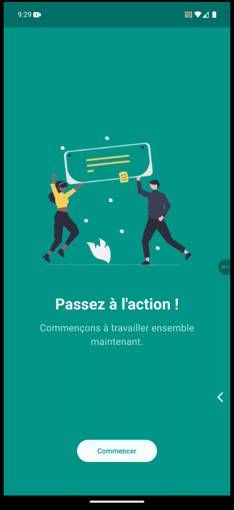 | 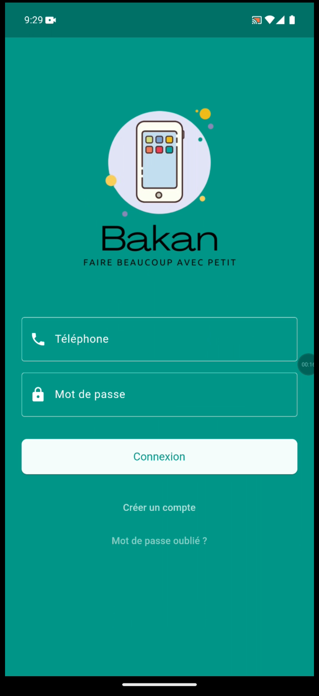 | 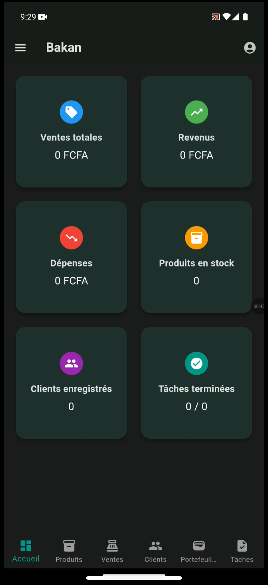 | 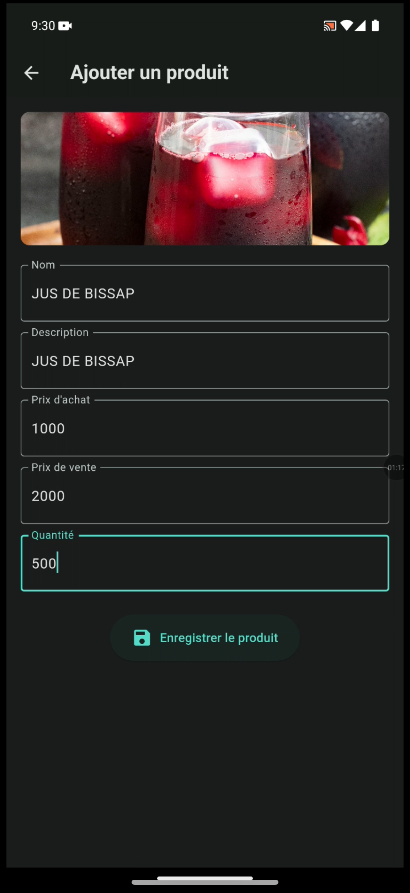 | 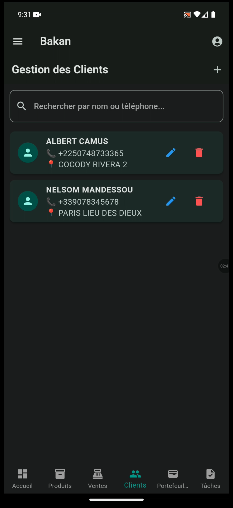 | 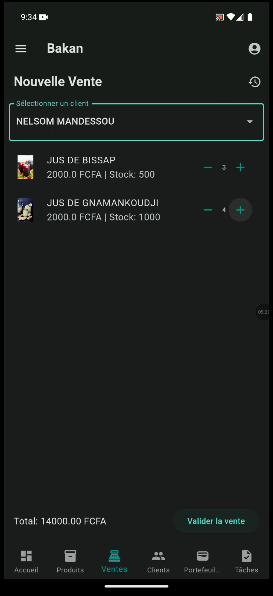 |

| Écran 7 | Écran 8 | Écran 9 | Écran 10 | Écran 11 | Écran 12 |
|--------|---------|---------|----------|----------|----------|
| 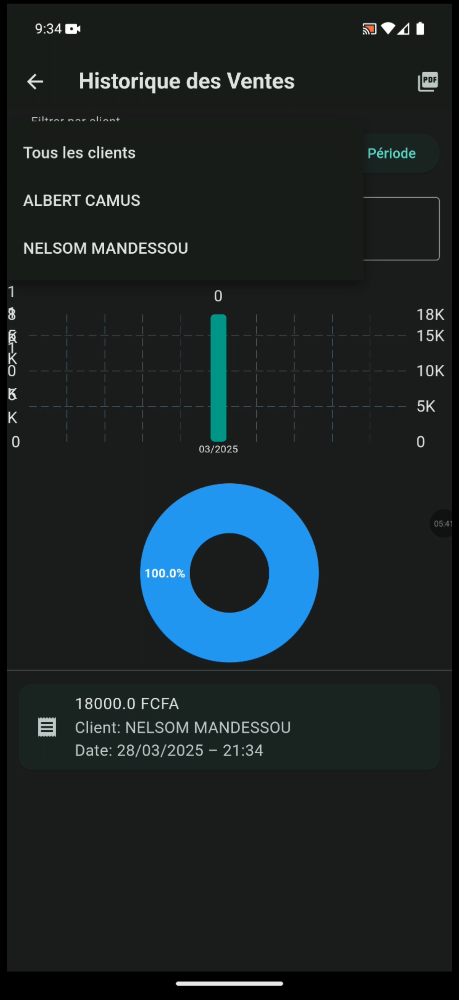 | 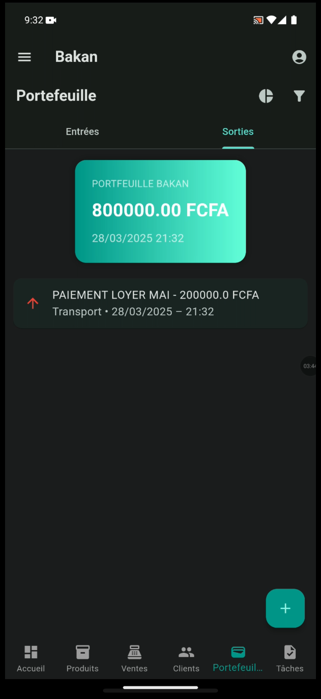 | 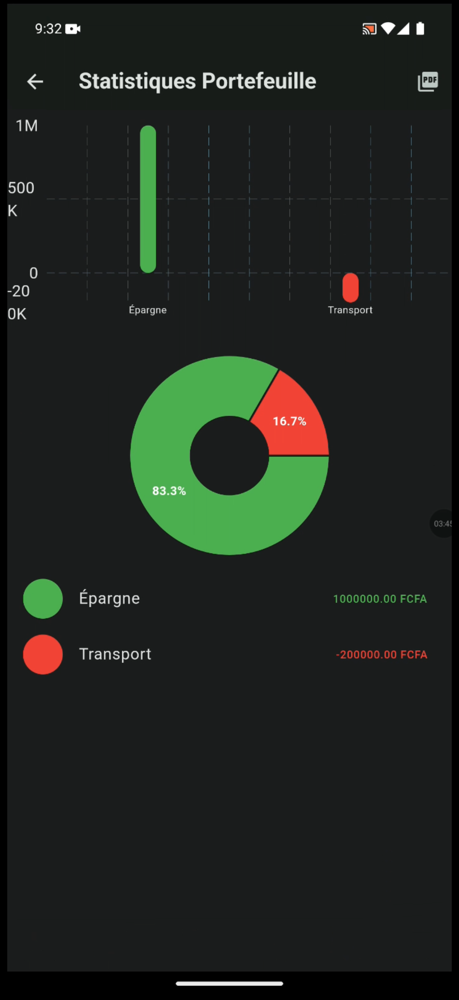 | 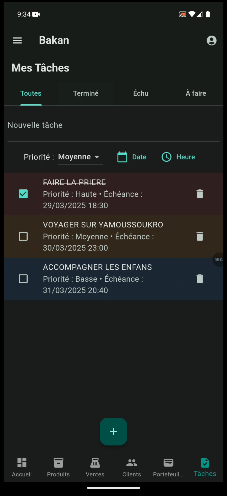 | 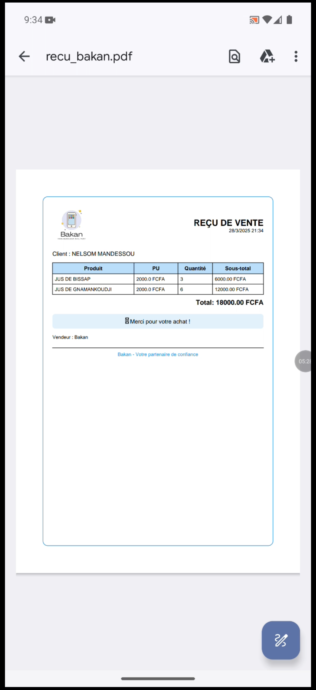 | 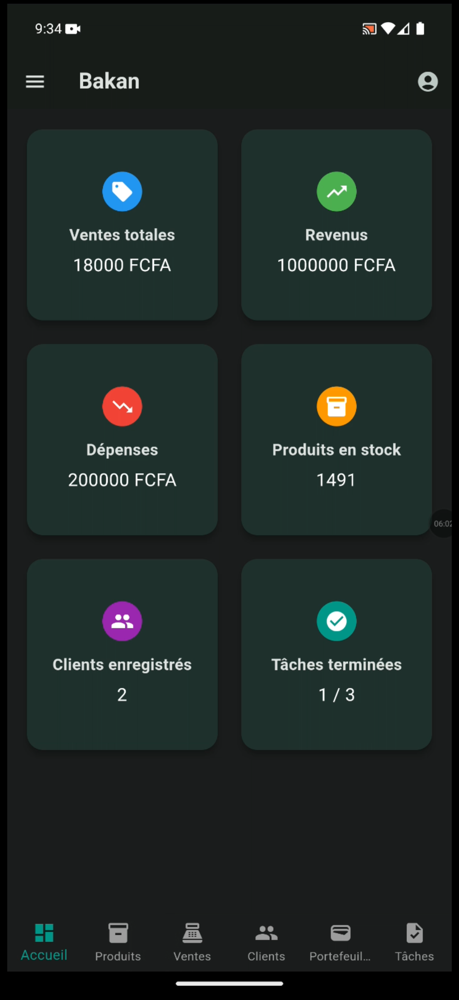 |

---


## 🚀 Installation

```bash
git clone https://github.com/daniel10027/bakan.git
cd bakan
flutter pub get
flutter run
```

> ✅ Nécessite Flutter 3.10+ — Application compatible Android 5.0+ (SDK 21 minimum).

---

## ⚠️ Notes Techniques

- L’application utilise `SharedPreferences` pour mémoriser les connexions et les préférences utilisateur.
- Les données sont stockées **localement** avec `sqflite`.
- Le support **Multidex** est activé pour éviter les erreurs liées à la limite des 64k méthodes.

---

## 🔜 À venir

- [ ] Synchronisation cloud (Drive/Firebase)
- [ ] Export PDF des ventes
- [ ] Support multi-utilisateur
- [ ] Dark mode

---

## 🙌 Développé par

**👤 @daniel10027**  
🎓 Développeur Flutter / Backend Python  
📬 Contact : `danielguedegbe10027@gmail.com`

---

## 📄 Licence

Ce projet est sous licence **MIT**. Utilisation libre à des fins personnelles ou commerciales.

---

> _"Bakan — Gérer intelligemment, vendre efficacement."_ 🚀